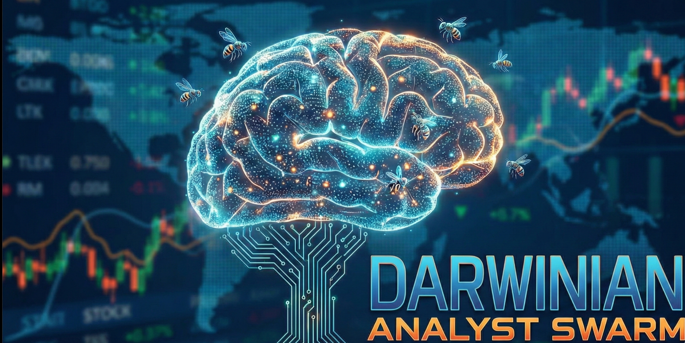

# Darwinian Analyst Swarm
---

   

> **"A self-correcting AI workforce that reads, reasons, and trades faster than any human."**

### *AI Agents that Read, Reason, and Trade.*


---

## 📖 Project Overview

**The Problem:**
In the financial world, information is infinite, but attention is scarce. By the time a human trader reads a report on a tech regulation change in the EU or a startup breakthrough in Asia, the market has already moved. Traditional trading bots are brittle; they follow strict `if/then` rules and cannot understand nuance, sentiment, or conflicting reports.

**The Solution:**
The **Darwinian Analyst Swarm** is an autonomous multi-agent system fueled by **Google Gemini**. Instead of a single script, it deploys a "team" of AI agents:
1.  **News Hunter:** Scours the web for real-time data.
2.  **Analyst Swarm:** Multiple AI personas debate the significance of the news.
3.  **Portfolio Manager:** A "Judge" agent that weighs the arguments and makes the final executive decision.
4.  **Trader:** Executes the trade via the Alpaca API.

---

## 🏗️ Architecture


*(Detailed agentic workflow flow diagram)*

Unlike traditional chatbots that wait for user prompts, the **Darwinian Analyst Swarm** is designed as an event-driven system. The workflow is triggered by the ingestion of live data, processes it through a strict reasoning engine, and pauses for human verification before taking financial action.

The architecture relies on **Pure Python** and the **Google Gen AI SDK** for maximum control and speed, removing the overhead of heavy orchestration frameworks.

### 🔄 The Intelligent Workflow


1.  **Trigger: The News Hunter Agent**
    * **Role:** Information Scout
    * **Action:** The cycle initiates immediately when the agent detects a specific stock ticker (e.g., from a watchlist or user input). It utilizes **DuckDuckGo Search** to scour the web for the latest financial news, filings, and market sentiment, aggregating raw text into a data packet.

2.  **Reasoning: The Analyst Swarm (Gemini 1.5)**
    * **Role:** The "Brain"
    * **Action:** The raw news data is fed into **Google Gemini 1.5 Flash**.
    * **Technique:** We utilize **Structured Output (JSON Mode)**. The model is forbidden from rambling; it must return a strict JSON object containing:
        * `Decision`: (BUY / SELL / HOLD)
        * `Confidence_Score`: (0-100)
        * `Reasoning`: A concise summary of *why*.

3.  **Filtering: The Portfolio Manager**
    * **Role:** Risk Gatekeeper
    * **Action:** This logic layer filters out weak signals. It enforces strict thresholds (e.g., "Confidence must be > 75%"). If the signal is weak or the sentiment is "HOLD," the workflow terminates immediately to save API costs and reduce risk.

4.  **Authorization: The Slack Sentinel (HITL)**
    * **Role:** Human-in-the-Loop Safety Layer
    * **Action:** High-conviction trades are **not** executed automatically. The agent formats a briefing and pings a private **Slack Channel**.
    * **Interaction:** The system pauses and waits. It proceeds only if the human operator replies with a specific authorization command (e.g., "YES").

5.  **Execution: The Trader Agent**
    * **Role:** The "Hands"
    * **Action:** Once authorized, the agent connects to the **Alpaca Paper Trading API**, calculates the position size, and submits a Market Order. It then reports the Fill Price back to the logs.

---

### 🧩 Technical Implementation

```python
# Pseudo-code representation of the new flow
def run_workflow(ticker):
    # 1. Trigger
    news = news_hunter.fetch(ticker)

    # 2. Reason (Google Gen AI SDK)
    analysis = gemini.generate_content(news, response_schema=JSON_SCHEMA)

    # 3. Filter
    if analysis.confidence < 75:
        return "Aborted: Low Confidence"

    # 4. Authorize (Slack SDK)
    user_approval = slack_bot.ask_permission(analysis)
    if not user_approval:
        return "Aborted: User Denied"

    # 5. Execute (Alpaca API)
    alpaca.submit_order(ticker, analysis.decision)

```
---

## 🚀 Key Features

* **Event-Driven "News First" Architecture**
    Unlike passive chatbots, this agent is proactive. It initiates the workflow the moment it detects fresh news signals, effectively acting as a 24/7 autonomous watchdog for your portfolio.

* **Human-in-the-Loop (HITL) via Slack**
    Automated trading is risky. We mitigate this by integrating a **Slack Safety Valve**. The agent calculates the trade, formats a briefing, and waits for a specific `YES` command from a human in a private Slack channel before executing money moves.

* **Structured Intelligence (JSON Mode)**
    Gone are the days of parsing messy chat text. This project leverages **Gemini 1.5's Native JSON Mode** (`response_mime_type="application/json"`), forcing the LLM to output decision data in a strict, machine-readable schema every single time.

* **Algorithmic Risk Management**
    The **Portfolio Manager** logic layer acts as a firewall. It filters out "hallucinated" or weak signals by enforcing a strict **Confidence Threshold (>75%)**. If the AI isn't sure, it doesn't trade.

* **Pure Python SDK Implementation**
    By removing heavy wrapper frameworks (like LangChain) and using the official **Google Gen AI SDK**, the codebase remains lightweight, easier to debug, and faster to deploy on serverless environments like Cloud Run.
  
## 🛠️ Technology Stack

* **Core Intelligence (The Brain):**
    * **Google Gemini 1.5 Flash:** Chosen for its speed, low latency, and massive context window (perfect for reading multiple news articles).
    * **Google Gen AI SDK (`google-genai`):** We use the native SDK instead of LangChain for cleaner, more controllable, and lightweight code.

* **Data & Execution (The Tools):**
    * **DuckDuckGo Search:** For retrieving real-time, non-hallucinated financial news.
    * **Alpaca Markets API:** For paper trading execution and portfolio management.
    * **Slack SDK:** For sending real-time alerts and handling Human-in-the-Loop (HITL) authorization.

* **Infrastructure:**
    * **Python 3.10+:** The runtime environment.
    * **Google Colab:** Used for rapid prototyping and testing.
    * **Pydantic:** Used for data validation and managing the agent's internal state.
---

## 🧩 Core Workflow Implementation

python
TBD

## ⚙️ Installation & Setup

### 1. Clone the Repository
```bash
git clone [https://github.com/YOUR_USERNAME/darwinian-analyst-swarm.git](https://github.com/YOUR_USERNAME/darwinian-analyst-swarm.git)
cd darwinian-analyst-swarm
```
